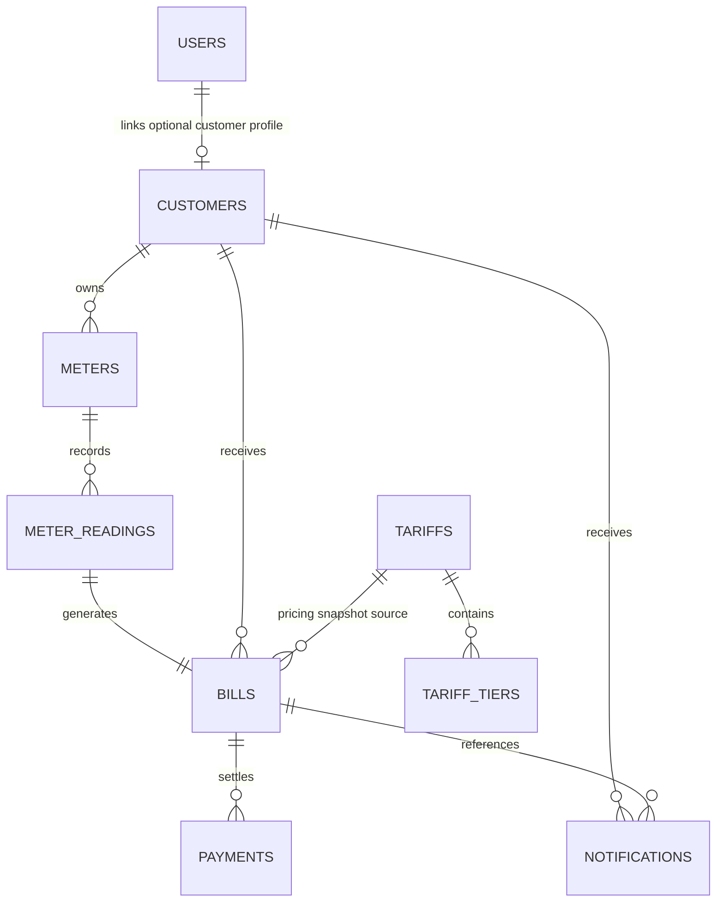

# ERD

## Notes

- Financial records are retained; bills and payments are not physically deleted.
- Customer-facing access is resolved from the authenticated user and linked customer profile.
- Money fields use `BigDecimal` in Java and fixed precision numeric columns in the database.
