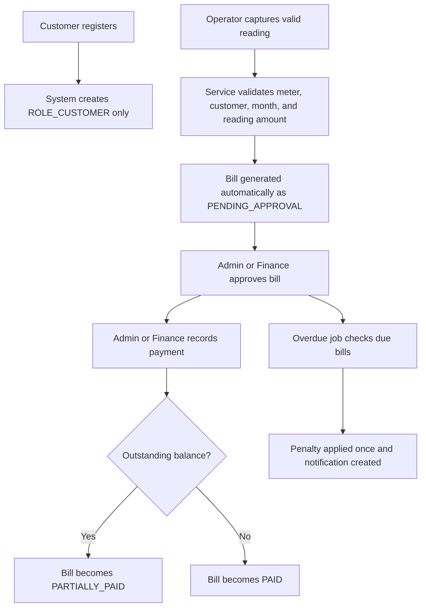

# Flow Diagram

```mermaid
flowchart TD
    A["Customer registers"] --> B["System creates ROLE_CUSTOMER only"]
    C["Operator captures valid reading"] --> D["Service validates meter, customer, month, and reading amount"]
    D --> E["Bill generated automatically as PENDING_APPROVAL"]
    E --> F["Admin or Finance approves bill"]
    F --> G["Admin or Finance records payment"]
    G --> H{"Outstanding balance?"}
    H -->|"Yes"| I["Bill becomes PARTIALLY_PAID"]
    H -->|"No"| J["Bill becomes PAID"]
    F --> K["Overdue job checks due bills"]
    K --> L["Penalty applied once and notification created"]
```
