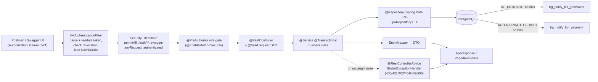
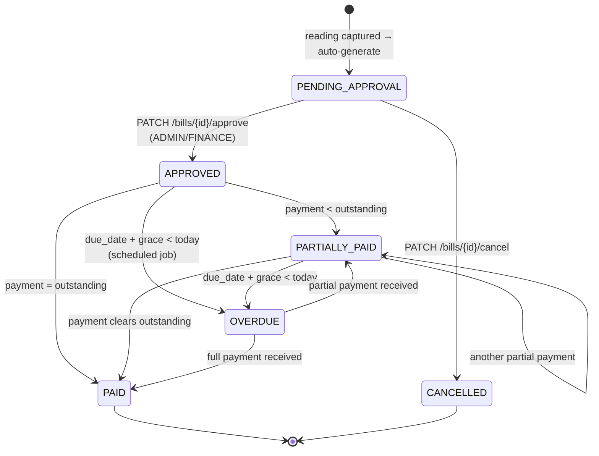

# Spring Boot Flow Diagram

Functional flow of the Utility Billing System. Each lane shows who acts; arrows
follow the actual implemented endpoints.

## 1. End-to-end business flow

```mermaid
flowchart TD
    subgraph PUBLIC["Public visitor"]
        A1["POST /auth/register<br/>(fullName, email, phone, password)"]
        A1 --> A2["System creates User<br/>role = ROLE_CUSTOMER<br/>status = ACTIVE, email_verified = false"]
        A2 --> A3["OTP emailed"]
        A3 --> A4["POST /auth/verify-email<br/>(email, otpCode)"]
        A4 --> A5["POST /auth/login → JWT"]
    end

    subgraph CUSTOMER["ROLE_CUSTOMER (self-service)"]
        B1["POST /customers/me/profile<br/>(nationalId, address)"]
        B1 --> B2["Customer profile created<br/>status = INACTIVE (pending admin verify)"]
    end

    subgraph ADMIN["ROLE_ADMIN"]
        C1["GET /admin/users/customers?unlinkedOnly=true<br/>(find userId to link, optional)"]
        C2["PATCH /customers/{id}/activate<br/>→ status = ACTIVE"]
        C3["POST /meters<br/>(meterNumber, type, installationDate, customerId)"]
        D1["Configure tariffs / fixed charges / taxes / penalties<br/>(effective_from must be ≥ today)"]
    end

    subgraph OPERATOR["ROLE_OPERATOR"]
        E1["POST /readings<br/>(meterId, currentReading, readingDate)"]
        E1 --> E2{Validate}
        E2 -- "future date / meter or customer inactive /<br/>current ≤ previous / duplicate month-year" --> E3["400 BusinessRuleException"]
        E2 -- ok --> E4["MeterReading saved<br/>consumption = current − previous"]
        E4 --> E5["billingService.generateBillForReadingId(reading.id)"]
    end

    subgraph BILLENGINE["Billing engine"]
        F1["Resolve tariff + fixed charge + tax + penalty<br/>by readingDate (newest version that covers)"]
        F1 --> F2["Compute amounts (BigDecimal HALF_UP)<br/>subtotal = tariff + fixed<br/>tax = subtotal × VAT%<br/>total = subtotal + tax"]
        F2 --> F3["Bill saved<br/>status = PENDING_APPROVAL<br/>due_date = readingDate + dueDays"]
        F3 --> F4["NotificationService + DB trigger<br/>fn_notify_bill_generated<br/>insert BILL_GENERATED notification<br/>(NOT EXISTS guard prevents duplicates)"]
    end

    subgraph FINANCE["ROLE_ADMIN / ROLE_FINANCE"]
        G1["PATCH /bills/{id}/approve<br/>→ status = APPROVED, approved_by/at set"]
        G2["POST /payments<br/>(billReference, amountPaid, method, date)"]
    end

    subgraph PAYMENTENGINE["Payment engine"]
        H1{Guards}
        H1 -- "amount ≤ 0 / over outstanding /<br/>bill not APPROVED|PARTIALLY_PAID|OVERDUE /<br/>CANCELLED / PAID" --> H2["400 BusinessRuleException"]
        H1 -- ok --> H3["Payment saved<br/>bill.amount_paid += amount<br/>bill.outstanding = total − amount_paid"]
        H3 --> H4{outstanding = 0?}
        H4 -- "no" --> H5["status = PARTIALLY_PAID<br/>PAYMENT_CONFIRMED notification"]
        H4 -- "yes" --> H6["status = PAID<br/>PAYMENT_CONFIRMED + BILL_PAID notification<br/>DB trigger fn_notify_full_payment fires"]
    end

    subgraph OVERDUE["Scheduled overdue job (01:00 daily) / POST /bills/process-overdue"]
        I1["Resolve active penalty config<br/>cutoff = today − gracePeriodDays"]
        I1 --> I2["SELECT bills WHERE status IN<br/>(APPROVED, PARTIALLY_PAID)<br/>AND due_date < cutoff"]
        I2 --> I3["For each bill (own transaction):<br/>apply penalty once<br/>status = OVERDUE<br/>BILL_OVERDUE notification"]
    end

    subgraph SELF["Customer self-service reads"]
        J1["GET /customers/me/bills<br/>/payments<br/>/notifications<br/>(requires profile ACTIVE)"]
    end

    A5 --> B1
    B2 --> C1
    C1 --> C2
    C2 --> C3
    C3 --> E1
    E5 --> F1
    F4 --> G1
    G1 --> G2
    G2 --> H1
    H6 --> J1
    H5 --> J1
    F4 -.->|"no payment by due_date + grace"| I1
```

## 2. Spring Boot layered request flow

## 3. Role × action matrix

| Action | ADMIN | FINANCE | OPERATOR | CUSTOMER |
|---|:---:|:---:|:---:|:---:|
| Create staff users | ✔ | | | |
| Activate / deactivate users | ✔ | | | |
| Create / activate / deactivate customers | ✔ | | | |
| Assign & manage meters | ✔ | | | |
| Configure tariffs, fixed charges, taxes, penalties | ✔ | | | |
| Capture meter readings | ✔ | | ✔ | |
| Approve / cancel bills | ✔ | ✔ | | |
| Record payments | ✔ | ✔ | | |
| Process overdue bills | ✔ | ✔ | | |
| Complete own profile | | | | ✔ |
| View own bills / payments / notifications | | | | ✔ |

## 4. Bill state machine

